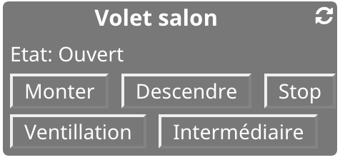
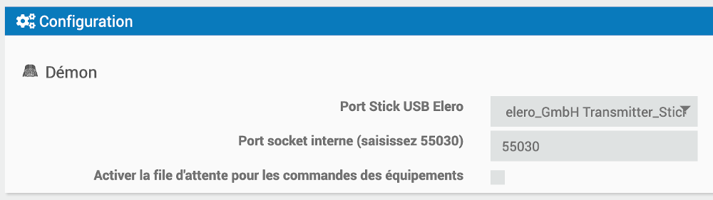
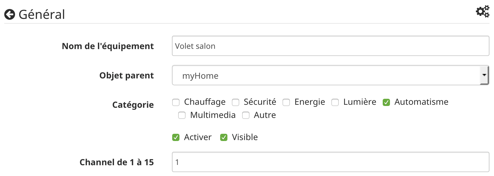

Présentation
============

**Le plugin Eleroha** interface les stores équipés d'un système Elero avec Jeedom.

**Prérequis**

>Pour fonctionner, Eleroha nécessite un stick USB Elero afin d'assurer la communication entre Jeedom et vos équipements Elero.

Aussi, vous devez préhalablement :
1. Associer vos stores Elero avec le stick USB comme cela est décrit dans la documentation Elero.
Vous noterez les channels qui correspondent à vos stores. Cette information vous sera demandée lors de la création de vos équipements dans Jeedom.
2. Placer le stick USB dans un port USB libre de votre box Jeedom

Les principales fonctionnalités de Eleroha sont :

**Le pilotage**

>Eleroha vous permet de monter, descendre, stopper, placer en position ventillation vos stores.

**Le monitoring**

>Eleroha vous indique la postion courante de vos stores

**Le widget Eleroha**

**Activation et configuration**

>Après avoir activé, le plugin il est indispensable de :
1. Sélectionner port du stick USB Elero.
2. Saisir le port 55030.

N'oubliez pas de sauvegarder.

**Création de votre équipement**

>Après avoir nommé l'équipement, saisissez le numéro du channel qui correspond à votre store.
Les channels sont numérotés de 1 à 15.
Le channel correspond à celui que vous avez associé avec votre store lors de l'étape de configuration du stick USB Elero.

N'oubliez pas de sauvegarder !

Félicitation, vous avez terminé.

Vous pouvez actualiser manuellement les informations en cliquant sur l'icône située en haut à droite du widget.

**Utilisation**

Attention :
* le stick Elero ne gère ni buffer ni file d'attente.
* Le stick Elero essaiera toujours de traiter la dernière commande reçue

Afin de pouvoir interrompre une commande par une autre à tout moment, Eleroha ne gère pas de file d'attente.

La commande Etat d'Eleroha stock le dernier état reçu de l'équipement. Elle peut être mise à jour en utilisant la commande rafraichir.

Voici les valeurs gérées :
* 00 : Aucune information
* 01 : Ouvert
* 02 : Fermé
* 03 : Intermédiaire
* 04 : Ventilation
* 05 : Equipement bloqué
* 06 : Surchauffe
* 07 : Timeout
* 08 : Début ouverture
* 09 : Début fermeture
* 0A : Ouverture
* 0B : Fermeture
* 0C : Arrêté position indéfinie
* 0D : Top position stop wich is tilt position
* 0E : Bottom position stop wich is intermediate position
* 0F : Equipement éteint
* 10 : Equipement allumé
* 11 : Etat inconnu

Afin de gérer au mieux les mises à jour d'état après une commande voici ce qui est conseiller de faire

1. Envoi de la commande (commande d'action, commande rafraichir exclue)
2. Attendre 10 seconde et rafraichir afin de connaitre l'état en cours
3. Attendre 3 minutes et rafraichir afin de connaitre l'état final.

Cette séquence est gérer par le plugin si aucune commande n'est envoyée, 3 minutes et 10 secondes avant la précédente.
